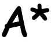

# kjkrol/astar

<p align="center">
  
  <br>
    <a href="https://go.dev">
    
  </a>
  <a href="https://pkg.go.dev/github.com/kjkrol/astar">
    
  </a>
  <a href="https://opensource.org/licenses/MIT">
    
  </a>
  <a href="https://github.com/kjkrol/astar/actions">
    
  </a>
</p>

**kjkrol/astart** is a **highly performant, fully generic A*** solver for Go. Perfect for optimal pathfinding and abstract state-space search.

## What is A*?

The [A* (A-star) algorithm](https://en.wikipedia.org/wiki/A*_search_algorithm) is a graph traversal and path search algorithm heavily used in computer science due to its completeness, optimality, and optimal efficiency. It is widely considered the best algorithm for finding the shortest path between nodes (e.g., in a 2D grid/map for game development). 

While most commonly used as a **Pathfinder**, this library provides a completely domain-agnostic `Solver`. You can use it to solve complex puzzles, optimize network routing, or navigate grids, simply by providing your own `Heuristic`, `Cost`, and `Successors` functions.

<a id="installation"></a>
# 📦 Installation

GOKe requires **Go 1.23** or newer.

```bash
go get github.com/kjkrol/goke
```

---

# ⏱️ Performance

This solver is built for extreme performance. By utilizing Go 1.18+ Generics, custom memory arenas, and highly optimized data structures, we drastically reduce memory allocations and prevent heap escapes during the hot path of the search.

**Key Optimizations:**
* **`WithIndexedSliceDict`:** Replaces standard Go maps with a pre-allocated slice for tracking visited nodes. It completely eliminates hashing overhead and interface boxing.
* **Node Arena:** An internal chunk-based memory arena ensures that millions of nodes can be processed with near-zero allocations after the initial setup.

## Benchmarks (Apple M1 Max)

As the grid size increases, the IndexedSliceDict shows massive scaling advantages. It outperforms the default Go map implementation by nearly **2x** on small grids, and scales up to over **4.3x** faster execution times on large spaces (2048x2048), all while maintaining a perfectly flat memory allocation profile.

| Grid Size | Dictionary Type | Time (ns/op) | Memory (B/op) | Allocs (allocs/op) |
| :--- | :--- | :--- | :--- | :--- |
| **64x64** | `IndexedSliceDict` | 20,884 | 4,216 | 12 |
| | `IndexedMapDict` | 36,467 | 4,216 | 12 |
| | `DefaultMapDict` | 38,557 | 4,216 | 12 |
| **256x256** | `IndexedSliceDict` | 108,993 | 16,504 | 14 |
| | `IndexedMapDict` | 201,557 | 16,507 | 14 |
| | `DefaultMapDict` | 209,424 | 16,505 | 14 |
| **512x512** | `IndexedSliceDict` | 256,729 | 50,578 | 16 |
| | `IndexedMapDict` | 668,239 | 50,561 | 16 |
| | `DefaultMapDict` | 804,137 | 50,563 | 16 |
| **1024x1024** | `IndexedSliceDict` | 720,912 | 120,383 | 18 |
| | `IndexedMapDict` | 2,361,323 | 120,278 | 18 |
| | `DefaultMapDict` | 3,084,423 | 120,306 | 18 |
| **2048x2048** | `IndexedSliceDict` | **2,009,488** | 260,743 | **20** |
| | `IndexedMapDict` | 7,348,637 | 260,084 | 20 |
| | `DefaultMapDict` | 8,680,021 | 260,230 | 20 |

---

# 🚀 Getting Started (Pathfinding Example)

Here is a step-by-step example of how to configure the solver to find the shortest path on a 2D grid.

### Define your domain state
The solver is generic, so you define the state. For a map, a simple `Point` struct works best.

```go
type Point struct {
	X, Y int
}
```

## Define the Rules (Heuristic, Cost, Successors)
You must define how the algorithm evaluates the distance to the goal, the cost of moving, and how to find neighboring states.
```go
// 1. Heuristic: Estimates the distance to the goal (e.g., Manhattan distance)
const weight = 2.0 // Adjust this factor to make the heuristic more or less aggressive
heuristic := func(current, goal Point) float64 {
	dx := math.Abs(float64(goal.X - current.X))
	dy := math.Abs(float64(goal.Y - current.Y))
	return (dx + dy) * weight
	// Note: Multiply by a weight > 1.0 here to create a "Weighted A*", 
	// drastically increasing speed at the cost of absolute optimal paths.
}

// 2. Cost: The penalty for entering a specific node (e.g., a swamp is harder to cross than a road)
cost := func(p Point) float64 {
	return 1.0 // Assume a flat cost for this example
}

// 3. Successors: Populates the buffer with valid moves from the current state
dirs := []Point{{-1, 0}, {1, 0}, {0, -1}, {0, 1}}
successors := func(p, pp Point, buffer []Point) []Point {
	for _, d := range dirs {
		nx, ny := p.X+d.X, p.Y+d.Y
		// Check bounds and avoid obstacles here
		if nx >= 0 && nx < 64 && ny >= 0 && ny < 64 {
			// prevent backtracking
			if nx == pp.X && ny == pp.Y {
				continue
			}
			buffer = append(buffer, Point{X: nx, Y: ny})
		}
	}
	return buffer
}
```

## Initialize the Solver and Find the Path
Pass your rules into astar.New. To unlock maximum performance, use WithIndexedSliceDict by providing an Indexer that maps your state to a unique integer.

```go
// The Indexer maps a 2D coordinate to a 1D slice index
indexer := func(p Point) int { 
    return p.Y * 64 + p.X 
}
maxNodes := 64 * 64

// Initialize the Solver
finder := astar.New(heuristic, cost, successors,
	astar.WithSuccessorCapacity[Point](4), // Pre-allocate buffer for 4 directions
	astar.WithIndexedSliceDict(maxNodes, indexer),
)

start := Point{X: 0, Y: 0}
goal := Point{X: 63, Y: 63}

// Execute the search
finder.Solve(start, goal)
path := finder.Result()

if path != nil {
	fmt.Println("Found path with length:", len(path))
}
```

# License

**kjkrol/astar** is licensed under the MIT License. See the LICENSE [file](./LICENSE) for more details.
